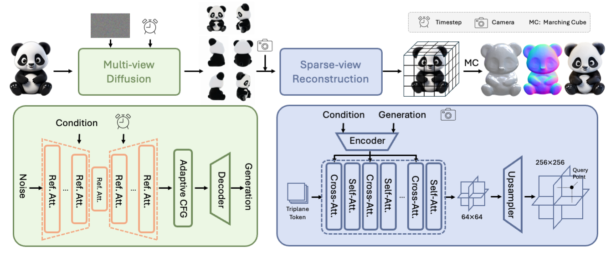
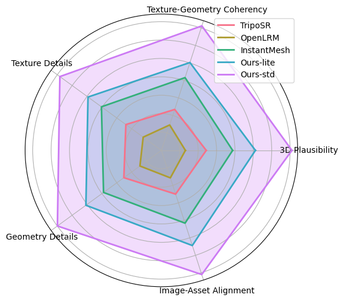
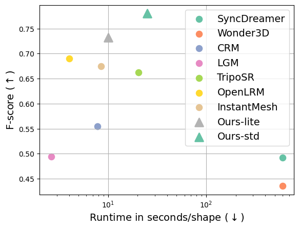

[English](README.md) | [简体中文](README_zh_cn.md)

<!-- ## **Hunyuan3D-1.0** -->

<p align="center">
  
</p>

# Tencent Hunyuan3D-1.0: A Unified Framework for Text-to-3D and Image-to-3D Generation

<div align="center">
  <a href="https://github.com/tencent/Hunyuan3D-1"></a> &ensp;
  <a href="https://3d-models.hunyuan.tencent.com"></a> &ensp;
  <a href="https://arxiv.org/pdf/2411.02293"></a> &ensp;
  <a href="https://huggingface.co/Tencent/Hunyuan3D-1"></a> &ensp;
  <a href="https://huggingface.co/spaces/Tencent/Hunyuan3D-1"></a> &ensp;
</div>


## 🔥🔥🔥 更新!!
- Jul 26, 2025: 🤗 我们发布了业界首个开源且兼容主流图形管线的3D世界生成模型 [HunyuanWorld-1.0](https://github.com/Tencent-Hunyuan/HunyuanWorld-1.0)!
- Jan 21, 2025: 🤗 欢迎来我们的门户网站 [Hunyuan3D Studio](https://3d.hunyuan.tencent.com) 体验更多3D生成功能!
- Jan 21, 2025: 🤗 我们开源 [Hunyuan3D 2.0](https://huggingface.co/tencent/Hunyuan3D-2)的推理代码和预训练权重.
- Jan 21, 2025: 🤗 我们发布了 [Hunyuan3D 2.0](https://huggingface.co/spaces/tencent/Hunyuan3D-2). 快来试试吧!

- Nov 21, 2024: 🤗 我们上传了新的纹理烘焙模块！
- Nov 20, 2024: 🤗 我们添加了中文版的 README。
- Nov 18, 2024: 🤗 感谢第三方开发者实现ComfyUI！[[1]](https://github.com/jtydhr88/ComfyUI-Hunyuan3D-1-wrapper)[[2]](https://github.com/MrForExample/ComfyUI-3D-Pack)[[3]](https://github.com/TTPlanetPig/Comfyui_Hunyuan3D)
- Nov 5, 2024: 🤗 已经支持图生3D。请在[script](#using-gradio)体验。
- Nov 5, 2024: 🤗 已经支持文生3D，请在[script](#using-gradio)体验。


## 📑 开源计划

- [x] Inference 
- [x] Checkpoints
- [x] Baking
- [ ] ComfyUI
- [ ] Training
- [ ] Distillation Version
- [ ] TensorRT Version


## **概要**
<p align="center">
  
</p>

为了解决现有的3D生成模型在生成速度和泛化能力上存在不足，我们开源了混元3D-1.0模型，可以帮助3D创作者和艺术家自动化生产3D资产。我们的模型采用两阶段生成方法，在保证质量和可控的基础上，仅需10秒即可生成3D资产。在第一阶段，我们采用了一种多视角扩散模型，轻量版模型能够在大约4秒内高效生成多视角图像，这些多视角图像从不同的视角捕捉了3D资产的丰富的纹理和几何先验，将任务从单视角重建松弛到多视角重建。在第二阶段，我们引入了一种前馈重建模型，利用上一阶段生成的多视角图像。该模型能够在大约3秒内快速而准确地重建3D资产。重建模型学习处理多视角扩散引入的噪声和不一致性，并利用条件图像中的可用信息高效恢复3D结构。最终，该模型可以实现输入任意单视角实现三维生成。


## 🎉 **Hunyuan3D-1.0 模型架构**

<p align="center">
  
</p>


## 📈 比较

通过和其他开源模型比较, 混元3D-1.0在5项指标都得到了最高用户评分。细节请查看以下用户研究结果。

轻量版模型仅需10s即可完成单图生成3D，标准版则大约需要25s。以下散点图表明腾讯混元3D-1.0实现了质量和速度的合理平衡。

<p align="center">
  
  
</p>

## 使用

#### 复制代码仓库

```shell
git clone https://github.com/tencent/Hunyuan3D-1
cd Hunyuan3D-1
```

#### Linux系统安装

env_install.sh 脚本提供了如何安装环境：

```
conda create -n hunyuan3d-1 python=3.9 or 3.10 or 3.11 or 3.12
conda activate hunyuan3d-1

pip3 install torch torchvision --index-url https://download.pytorch.org/whl/cu121
bash env_install.sh

# or
pip3 install -r requirements.txt --index-url https://download.pytorch.org/whl/cu121
pip3 install git+https://github.com/facebookresearch/pytorch3d@stable
pip3 install git+https://github.com/NVlabs/nvdiffrast
```

由于dust3r的许可证限制, 我们仅提供其安装途径:

```
cd third_party
git clone --recursive https://github.com/naver/dust3r.git

cd ../third_party/weights
wget https://download.europe.naverlabs.com/ComputerVision/DUSt3R/DUSt3R_ViTLarge_BaseDecoder_512_dpt.pth

```


<details>
<summary>💡一些环境安装建议</summary>
    
可以选择安装 xformers 或 flash_attn 进行加速:

```
pip install xformers --index-url https://download.pytorch.org/whl/cu121
```
```
pip install flash_attn
```

Most environment errors are caused by a mismatch between machine and packages. You can try manually specifying the version, as shown in the following successful cases:
```
# python3.9
pip install torch==2.0.1 torchvision==0.15.2 --index-url https://download.pytorch.org/whl/cu118 
```

when install pytorch3d, the gcc version is preferably greater than 9, and the gpu driver should not be too old.

</details>

#### CUDA 13 / Blackwell GPU 的 Docker 运行方式

仓库内的多阶段镜像已经固定 PyTorch CUDA 13、nvdiffrast 和 xFormers，
Windows 不需要另外安装 CUDA Toolkit 或 MSVC。先下载模型权重，再构建镜像：

```shell
docker compose build
```

普通 `main.py` lite 流程即使使用 `--save_memory` 仍约需 18 GB 显存。
16 GB 显卡应让各模型在独立进程中运行：

```shell
docker compose run --rm hunyuan3d python scripts/text_to_3d_low_vram.py \
  "a small red toy robot" --output outputs/docker-low-vram
```

快速验证可降低采样步数和面数：

```shell
docker compose run --rm hunyuan3d python scripts/text_to_3d_low_vram.py \
  "a small red toy robot" --output outputs/docker-smoke \
  --t2i-steps 1 --gen-steps 1 --max-faces 1000
```

默认输出为 `mesh_vertex_colors.obj`；增加 `--texture-mapping` 会同时生成
`mesh.glb`。已有阶段文件时可用 `--start-stage mesh` 继续。核心镜像不包含
可选的 PyTorch3D/DUSt3R 烘焙和 GIF 渲染依赖。

#### 下载预训练模型

模型下载链接 [https://huggingface.co/tencent/Hunyuan3D-1](https://huggingface.co/tencent/Hunyuan3D-1):

+ `Hunyuan3D-1/lite`, lite model for multi-view generation.
+ `Hunyuan3D-1/std`, standard model for multi-view generation.
+ `Hunyuan3D-1/svrm`, sparse-view reconstruction model.


为了通过Hugging Face下载模型，请先下载 huggingface-cli. (安装细节可见 [here](https://huggingface.co/docs/huggingface_hub/guides/cli).)

```shell
python3 -m pip install "huggingface_hub[cli]"
```

请使用以下命令下载模型:

```shell
mkdir weights
huggingface-cli download tencent/Hunyuan3D-1 --local-dir ./weights

mkdir weights/hunyuanDiT
huggingface-cli download Tencent-Hunyuan/HunyuanDiT-v1.1-Diffusers-Distilled --local-dir ./weights/hunyuanDiT
```

#### 推理 
对于文生3D，我们支持中/英双语生成，请使用以下命令进行本地推理：
```python
python3 main.py \
    --text_prompt "a lovely rabbit" \
    --save_folder ./outputs/test/ \
    --max_faces_num 90000 \
    --do_texture_mapping \
    --do_render
```

对于图生3D，请使用以下命令进行本地推理：
```python
python3 main.py \
    --image_prompt "/path/to/your/image" \
    --save_folder ./outputs/test/ \
    --max_faces_num 90000 \
    --do_texture_mapping \
    --do_render
```
更多参数详解：

|    Argument        |  Default  |                     Description                     |
|:------------------:|:---------:|:---------------------------------------------------:|
|`--text_prompt`  |   None    |The text prompt for 3D generation         |
|`--image_prompt` |   None    |The image prompt for 3D generation         |
|`--t2i_seed`     |    0      |The random seed for generating images        |
|`--t2i_steps`    |    25     |The number of steps for sampling of text to image  |
|`--gen_seed`     |    0      |The random seed for generating 3d generation        |
|`--gen_steps`    |    50     |The number of steps for sampling of 3d generation  |
|`--max_faces_numm` | 90000  |The limit number of faces of 3d mesh |
|`--save_memory`   | False   |module will move to cpu automatically|
|`--do_texture_mapping` |   False    |Change vertex shadding to texture shading  |
|`--do_render`  |   False   |render gif   |


如果显卡内存有限，可以使用`--save_memory`命令，最低显卡内存要求如下：
- Inference Std-pipeline requires 30GB VRAM (24G VRAM with --save_memory).
- Inference Lite-pipeline requires 22GB VRAM (18G VRAM with --save_memory).
- Note: --save_memory will increase inference time

```bash
bash scripts/text_to_3d_std.sh 
bash scripts/text_to_3d_lite.sh 
bash scripts/image_to_3d_std.sh 
bash scripts/image_to_3d_lite.sh 
```

如果你的显卡内存为16G，可以分别加载模型到显卡:
```bash
bash scripts/text_to_3d_std_separately.sh 'a lovely rabbit' ./outputs/test # >= 16G
bash scripts/text_to_3d_lite_separately.sh 'a lovely rabbit' ./outputs/test # >= 14G
bash scripts/image_to_3d_std_separately.sh ./demos/example_000.png ./outputs/test  # >= 16G
bash scripts/image_to_3d_lite_separately.sh ./demos/example_000.png ./outputs/test # >= 10G
```

####  纹理烘焙

我们提供了纹理烘焙模块。对齐和变形过程是使用Dust3R完成的，遵守CC BY-NC-SA 4.0许可。请注意，这是一个非商业许可证，因此该模块不能用于商业目的。

```bash
mkdir -p ./third_party/weights/DUSt3R_ViTLarge_BaseDecoder_512_dpt
huggingface-cli download naver/DUSt3R_ViTLarge_BaseDecoder_512_dpt \
    --local-dir ./third_party/weights/DUSt3R_ViTLarge_BaseDecoder_512_dpt

cd ./third_party
git clone --recursive https://github.com/naver/dust3r.git

cd ..
```
如果您使用相关代码和权重，我们也列出一些烘焙相关参数：

|    Argument        |  Default  |                     Description                     |
|:------------------:|:---------:|:---------------------------------------------------:|
|`--do_bake`  |   False   | baking multi-view images onto mesh   |
|`--bake_align_times`  |   3   | alignment number of image and mesh |


注意：如果需要烘焙，请确保`--do_bake`设置为`True`并且`--do_texture_mapping`也设置为`True`。

```bash
python main.py ... --do_texture_mapping --do_bake (--do_render)

#### Gradio界面部署

我们分别提供轻量版和标准版界面：

```shell
# std 
python3 app.py
python3 app.py --save_memory

# lite
python3 app.py --use_lite
python3 app.py --use_lite --save_memory
```

Gradio界面体验地址为 http://0.0.0.0:8080. 这里 0.0.0.0 应当填写运行模型的机器IP地址。

## 相机参数

生成多视图视角固定为

+ Azimuth (relative to input view): `+0, +60, +120, +180, +240, +300`.


## 引用

如果我们的仓库对您有帮助，请引用我们的工作
```bibtex
@misc{yang2024tencent,
    title={Tencent Hunyuan3D-1.0: A Unified Framework for Text-to-3D and Image-to-3D Generation},
    author={Xianghui Yang and Huiwen Shi and Bowen Zhang and Fan Yang and Jiacheng Wang and Hongxu Zhao and Xinhai Liu and Xinzhou Wang and Qingxiang Lin and Jiaao Yu and Lifu Wang and Zhuo Chen and Sicong Liu and Yuhong Liu and Yong Yang and Di Wang and Jie Jiang and Chunchao Guo},
    year={2024},
    eprint={2411.02293},
    archivePrefix={arXiv},
    primaryClass={cs.CV}
}
```
