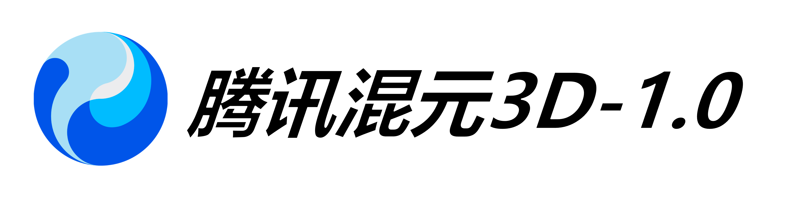

# Hunyuan3D-Comprehensive: Research & Implementation

<div align="center">
  
  <p><strong>A unified framework for high-fidelity Text-to-3D and Image-to-3D generation.</strong></p>
  
  <p>
    
    
    
    
  </p>
</div>

---

## 🌟 Overview

This repository is a comprehensive monorepo consolidating Tencent's **Hunyuan3D** ecosystem. It bridges the gap between the foundational **Hunyuan3D-1.0** (MVD-SVRM architecture) and the cutting-edge **Hunyuan3D-2.0/2.5** (DiT-FlowMatching), while providing a strategic research outlook into the **2026 Q2 SOTA** landscape (including Hunyuan3D 3.1).

### 🚀 Key Highlights (2026 Update)
- **Hunyuan3D 3.1 Ready**: Support for **Eight-View Generation** (eliminating blind spots) and **Interactive Brush**-guided refinement.
- **Dual-Generation Pipelines**: 
  - **V1 (Fast)**: Lite/Standard pipelines for rapid reconstruction (<10s).
  - **V2 (Fidelity)**: DiT-based shape generation + Paint-based 4K PBR texture synthesis.
- **Production-Ready**: Native **Quad-Mesh** topology and full PBR material support (Albedo, Normal, Roughness, Metalness).

---

## 📊 Performance Matrix (2026 SOTA)

| Feature | Hunyuan3D 3.1 (Latest) | Rodin Gen-2 | Tripo P1.0 | Trellis 3D |
| :--- | :--- | :--- | :--- | :--- |
| **Resolution** | **3.6B Voxels (1536³)** | 10B Params | Game-Ready | High-Precision |
| **Speed** | 20-40s | 30-60s | **2-10s (Instant)** | 10-25s |
| **View Support** | **8-View (Omni)** | 4-6 View | 4 View | 4 View |
| **Topology** | Optimized Quad | Pro Quad | **Native Quad** | High-Poly Tri |
| **Interaction** | **Interactive Brush** | Semantic Edit | Stylization | Local Edit |

---

## 🏗️ Architecture Evolution

1.  **Stage 1 (V1.0)**: Multi-view Diffusion (MVD) + Sparse-view Reconstruction (SVRM). Focus on speed.
2.  **Stage 2 (V2.0/2.5)**: Diffusion Transformer (DiT) + Flow Matching. Focus on geometric fidelity and PBR textures.
3.  **Stage 3 (V3.1 - 2026)**: Eight-View Reference Injection + Interactive Guidance. Focus on "Zero-Blind-Spot" production and human-in-the-loop refinement.

---

## 📂 Repository Structure

```text
.
├── Hunyuan3D-1/             # V1.0: Multi-view Diffusion & SVRM
│   └── 3D_AI_Models_2026.md # 2026 Research Report (latest)
├── Hunyuan3D-2/             # V2.0/2.5: DiT & PBR Texture Synthesis
├── GEMINI.md                # Technical context for AI agents
└── README.md                # You are here
```

---

## 🛠️ Getting Started

### 1. Installation

#### For Hunyuan3D-1.0:
```bash
cd Hunyuan3D-1
conda create -n hunyuan3d-1 python=3.10
pip install torch torchvision --index-url https://download.pytorch.org/whl/cu121
bash env_install.sh
```

#### For Hunyuan3D-2.0:
```bash
cd Hunyuan3D-2
pip install -r requirements.txt
pip install -e .
# Compile custom texture operators
cd hy3dgen/texgen/custom_rasterizer && python setup.py install
```

### 2. Inference Quickstart

**Hunyuan3D-1 (Text-to-3D):**
```bash
python Hunyuan3D-1/main.py --text_prompt "a dragon statue" --do_render
```

**Hunyuan3D-2 (Image-to-3D):**
```bash
python Hunyuan3D-2/minimal_demo.py # Uses assets/demo.png
```

---

## 📅 Roadmap 2026

- [x] **Q1 2026**: Integration of Hunyuan3D 3.1 Eight-View Research.
- [ ] **Q2 2026**: Support for **Hunyuan-Omni** controllable generation (Point Cloud/Skeleton).
- [ ] **Q3 2026**: Automated **LOD (Level of Detail)** generation for mobile game engines.
- [ ] **Q4 2026**: Real-time **Neural Rendering (NeRF/Gaussian Splatting)** integration.

---

## ❓ FAQ & Troubleshooting

**Q: Out of Memory (OOM) on 16GB VRAM?**
A: Use `--save_memory` in V1 or `--low_vram_mode` in V2. Also, ensure `xformers` is installed.

**Q: Ninja compilation fails?**
A: Ensure `Visual Studio Build Tools` (Windows) or `gcc/g++` (Linux) are correctly configured in your PATH.

---

## 📜 Documentation & Research
- [**2026 Research Report**](./Hunyuan3D-1/3D_AI_Models_Research_2026.md): Deep dive into Eight-View generation, Brush interaction, and the shift to LATTICE-based 10B parameter models.
- [**Hunyuan3D-1 Readme**](./Hunyuan3D-1/README.md)
- [**Hunyuan3D-2 Readme**](./Hunyuan3D-2/README.md)

---

## 🤝 Citation & Licensing
This project includes code from Tencent Hunyuan3D, licensed under the **TENCENT HUNYUAN NON-COMMERCIAL LICENSE**. 

```bibtex
@misc{hunyuan3d2026,
    title={Hunyuan3D Comprehensive: Evolution from MVD to 8-View Interaction},
    author={kevinten-ai Research Team},
    year={2026}
}
```
